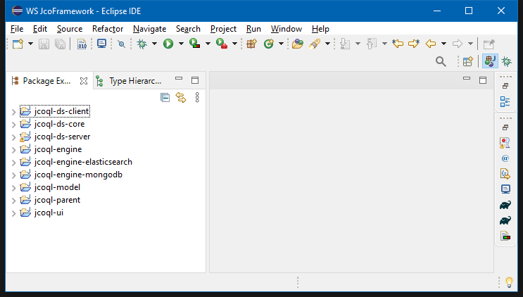

# JCo Framework Code
Java code of the JCo Framework (here the [landing page of the project](https://github.com/JcoProjectTeam/JcoProjectPage)).  
The code can be easily imported on an Eclipse IDE using the [Gradle 7.4.2](https://docs.gradle.org/7.4.2/userguide/userguide.html) tool.   
The following instruction are written according to the assumption the developer is working on a Windows machine using an Eclipse IDE with a Gradle plug-in installed.  
However the gradlew scripts should be compatible also with UNIX/LINUX machines.  

For any import issue contact Paolo Fosci at paolo.fosci@unibg.it.  

(update of 21-07-2022)  
  
  
## Import the code
Download the whole content of this repository in a folder on your computer.    
Open a command shell window on the folder where you download the code repository.    
Launch the following commands:  
1. \> gradlew cleanEclipse
2. \> gradlew Eclpse  
3. \> gradlew updateDependencies  

Once the _gradlew_ scripts have been launched with no error, open your Eclipse IDE, create a new _workspace_, and use the _"Existing Gradle Project"_ from the _Import_ wizard. In case of success the Eclipse should present a configuration like this:  

  
  
  
## Reset of Eclipse Settings
If it is necessary to reset the Eclipse folder, open a command shell window on the folder where you download the repository and launch the following commands:  
1. \> gradlew cleanEclipse  
2. \> gradlew Eclipse  
  
  
  
## Code Generation
To generate the executable java Jars download the content of the following repository https://github.com/JcoProjectTeam/JcoFrameworkCode in a folder named _`jcoJars`_  at the same root level where you have the folder with the code (the name of the _`jcoJars`_ folder can be changed, modifying accordingly all the _`*.gradle`_ configuration files in the code folder and sub-folders, and all the _`*.bat`_ scripts).   
Open a command shell window on the folder where you download the code repository. Launch the following Windows script:  
* \> updateJar.bat  

or, alternatively:  
1. \> gradlew jar  
2. \> gradlew thinJar  
3. \> gradlew thinResolve  
4. \> copyJar.bat  
  
  
  
## Testing class
To test the code, using Eclipse, the developer can launch the following classes:  
| module | class | description |  
| ------ | ----- | ----------- |  
| jcoql-engine | jco.ql.engine.JcoScriptLauncher | To execute JCoQL scripts from a file in batch mode |  
| jcoql-engine | jco.ql.tester.ZunParserTester | To compile JCoQL scripts from a file in batch mode |  
| jcoql-engine | jco.ql.engine.server.Server | To launch the JCo Engine in order to execute JCo User Interface scripts |  
| jcoql-engine | jco.ql.engine.server.Server | To launch the JCo Engine |  
| jcoql-ui | jco.ql.ui.client.Client | To launch the JCo User Interface (needs the JCo-Engine active to execute scripts) |  
| jcoql-ds-server | jco.ql.db.ds.server.Server | To launch the JCo-DS Server |  
| jcoql-ds-client | jco.ql.db.ds.client.Client | To launch the JCo-DS Client (needs the JCo-DS Server active to run properly) |  
  
  
  
## JCo-Engine Settings
In the folder [./jcoql-engine/config/settings.properties](./jcoql-engine/config/settings.properties) is possible to set advanced parameters for _JCo-Engine_ and _JCo-DS_:  
| Parameter | Description | Default value |  
| --------- | ----------- | ------ |  
| _nProcessors_ | Number of processors to use in the hosting machine | _4_ |   
| _server.data-path_ | Location  of the _JCo Engine_ repository folder | _./data_ |  
| _server.port_ | Communication port for _JCo-DS_ communication | _17017_ |  

